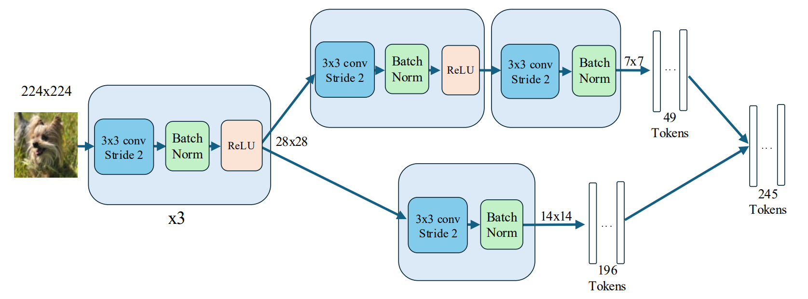
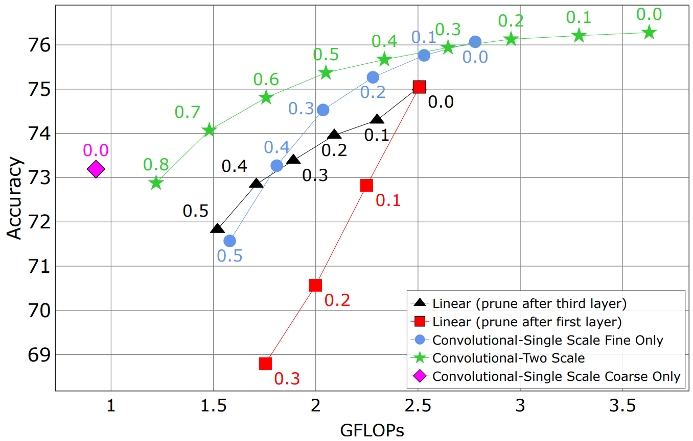

# Pruning-Aware Tokenization for Vision Transformers

Efficient Vision Transformers through robust early token pruning.

## Overview

Driven by the goal of reducing computational costs via early token pruning, we investigate strengthening the initial tokenization layer. 
Specifically, we replace the standard tokenizer with a small, multi-layer convolutional stem that introduces hierarchical, nonlinear feature extraction 
and enlarged receptive fields. 
This modification improves the robustness of ViTs to early token dropping. 
Furthermore, we extend this design with a secondary branch that generates a supplementary set of low-resolution tokens. 
By providing greater spatial coverage, this coarse-scale representation allows a small subset of tokens to preserve a global view of the image even under aggressive pruning rates.

## Key Results

| Model | Accuracy | GFLOPs | Throughput |
|------|----------|--------|------------|
| ViT baseline | ... | ... | ... |
| PAT-ViT | ... | ... | ... |

## Method

[architecture]

## Token Pruning

[visualization]

## Experiments

### ImageNet-1K

...

### Ablation Studies

...

## Installation

...

## Training

...

## Evaluation

...

## Citation

...
